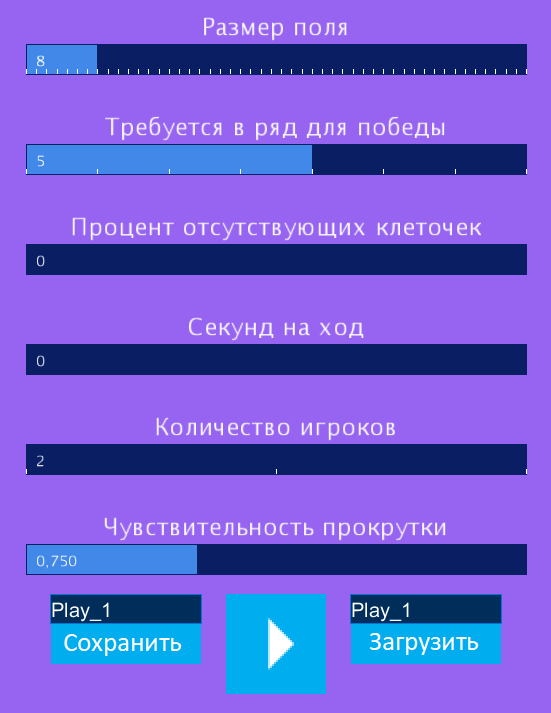

# Игра 3D крестики нолики (Графическое, Windows, Linux)

&emsp;&emsp;Игра для 2-4 игроков. Развивает пространственное мышление в игровой обстановке. Игры довольно весёлые, но очень медленные.

## Основная информация

### Стек технологий разработки

1. Processing (IDE): Processing (Java).

### Фото работы

1. Главное меню

	

1. В игре

	

### Управление

|Клавиша|Действие|
|-|-|
|Колёсико|срезать кубик, чтобы взаимодействовать с его внутренностями|
|Пробел|войти\\выйти из режима редактирования|
|Двойной клик в режиме редактирования|поставить шарик|
|Шифт|приблизить\\отдалить|
|Стереть (backspace)|убрать\\показать сетку|

## Дата

&emsp;&emsp;Март 2022г.

## Заключение

&emsp;&emsp;Ну прикольно, чё. Написал для тренеровки программирования, написал неплохо. Работает полностью так, как я хотел.